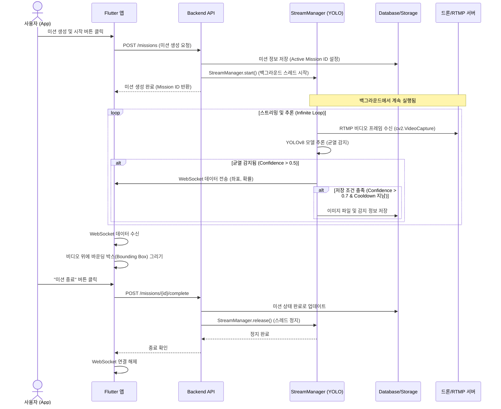

# Wall-E 프로젝트 전체 작동 시퀀스 (Project Sequence)

이 문서는 Wall-E 프로젝트의 **미션 생성부터 종료까지**의 전체적인 데이터 흐름과 시스템 상호작용 과정을 설명합니다.

## 1. 개요 (Overview)
- **앱 (Frontend)**: 사용자 인터페이스, 비디오 스트리밍 재생, 실시간 감지 결과 표시
- **백엔드 (Backend)**: RTMP 스트림 수신, YOLOv8 모델 추론, WebSocket 데이터 전송, DB 저장
- **드론/소스 (Video Source)**: RTMP로 비디오 송출 (예: `obs`, `ffmpeg`, 드론 카메라)

---

## 2. 상세 시퀀스 다이어그램 (Sequence Diagram)

---

## 3. 단계별 상세 설명

### 1단계: 미션 생성 및 시작 (Mission Start)
1.  **사용자**: 앱에서 미션 이름, 장소 등을 입력하고 시작 버튼을 누릅니다.
2.  **API**: `POST /missions` 엔드포인트가 호출됩니다.
3.  **백엔드**: DB에 새로운 미션 레코드를 생성하고, **`StreamManager`를 시작**합니다. 이때 `active_mission_id`가 설정되어 감지된 데이터를 이 미션에 연결할 준비를 합니다.

### 2단계: 실시간 영상 처리 및 추론 (Streaming & Inference)
1.  **StreamManager**: 별도의 스레드에서 계속해서 RTMP 서버(`rtmp://...`)로부터 비디오 프레임을 가져옵니다.
2.  **YOLOv8**: 가져온 프레임에 대해 딥러닝 모델이 균열을 찾습니다.
3.  **데이터 전송 (WebSocket)**: 균열이 감지될 때마다(`Confidence > 0.5`), 결과를 WebSocket(`ws://...`)을 통해 연결된 앱으로 실시간 전송합니다.
4.  **자동 저장 (Auto-Save)**: 만약 정확도가 매우 높다면(`Confidence > 0.7`), 해당 이미지를 서버 로컬 스토리지(`storage/images`)에 저장하고 DB에 기록합니다. (중복 저장 방지를 위해 2초 쿨타임 적용)

### 3단계: 앱 모니터링 (Monitoring)
1.  **앱**: HLS(`http://...m3u8`)를 통해 영상을 재생하고 있습니다.
2.  **오버레이**: 백엔드로부터 WebSocket으로 받은 좌표(`bbox`) 데이터를 이용해 비디오 위에 빨간색 네모 박스(바운딩 박스)를 그립니다.

### 4단계: 미션 종료 (Mission Complete)
1.  **사용자**: "미션 종료" 버튼을 누릅니다.
2.  **API**: `POST .../complete` 엔드포인트가 호출됩니다.
3.  **백엔드**: 
    - DB에서 미션을 완료 상태로 바꿉니다.
    - **`StreamManager.release()`**를 호출하여 카메라 연결을 끊고 추론 루프를 완전히 정지시킵니다.
4.  **앱**: 스트리밍 화면을 닫고 결과 화면으로 이동합니다.
