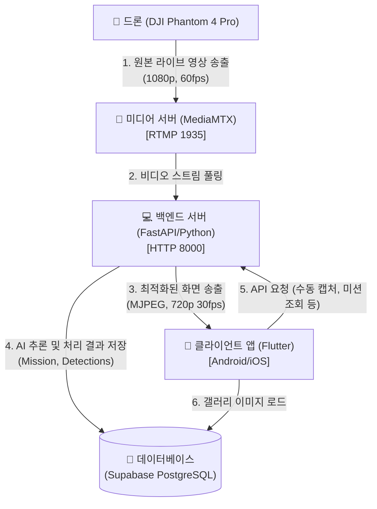
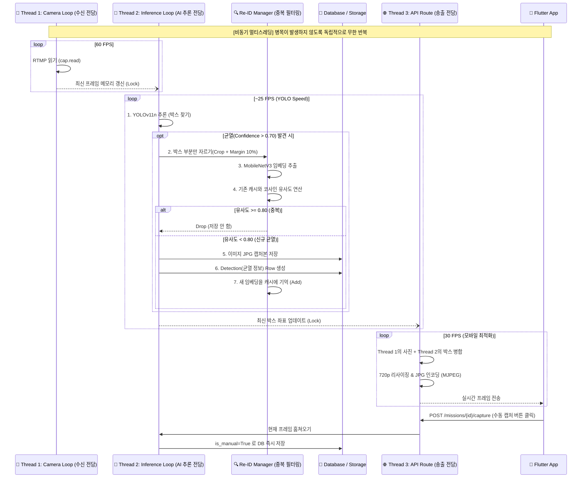

# Wall-E 프로젝트 시스템 아키텍처 (System Architecture)

본 문서는 Wall-E (외벽 균열을 점검하는 무인 드론 시스템)의 전체 데이터 흐름과 시스템 컴포넌트 간의 상호작용을 정리한 종합 아키텍처 가이드입니다.

## 1. 전체 시스템 구성도 (System Overview)

드론에서 촬영된 영상이 사용자의 스마트폰(Flutter 앱)으로 스트리밍 되며, 중간 매개체인 백엔드 영상 서버에서 실시간 AI 분석 및 중복 필터링이 일어나는 3-Tier 구조입니다.

---

## 2. 🚀 백엔드 핵심 스트리밍 파이프라인 (3-Track 비동기 아키텍처)

가장 연산량이 복잡하고 아키텍처의 핵심인 `StreamManager` (`stream_manager_ai_only.py`) 내부의 흐름도입니다. 
영상 수신, AI 연산, 클라이언트 송출 병목을 막기 위해 **3개의 쓰레드(일꾼)가 비동기(Asynchronous)로 완벽히 분리**되어 동작합니다.

---

## 3. 기능/기술 스택 별 핵심 컴포넌트

### 3.1 💻 AI 영상 분석 (Backend)
- **프레임워크:** Python `FastAPI`, `Uvicorn`
- **객체 탐지 (Object Detection):** `Ultralytics YOLO11n` (사용자 정의 학습 모델 - 균열 탐지)
- **중복 균열 필터 (Re-Identification):** `PyTorch` + `MobileNetV3-small` (오프라인 로컬 가중치 사용)
- **영상 처리:** `OpenCV (cv2)` 
- **DB ORM:** `SQLAlchemy` (PostgreSQL)

### 3.2 📱 사용자 앱 (Frontend)
- **프레임워크:** `Flutter`, `Dart`
- **실시간 비디오 렌더링:** `flutter_mjpeg` 패키지를 통한 MJPEG 초고속 렌더링. 블랙스크린 및 메모리 누수 방지.
- **주요 화면:** 
  - **새 미션 화면 (드론 연결):** 실시간 드론 배터리/신호 상태 연동 준비
  - **라이브 스트리밍 화면:** AI 오버레이 영상 재생 및 🙋‍♂️ `수동 캡처(Manual Capture) FAB` 버튼 기능
  - **결과 조회 화면 (Gallery):** 미션별 통계 및 AI 자동 저장 균열 / 수동 식별 사진 리스트 조회 기능

### 3.3 💾 데이터베이스 (Supabase)
- **관계형 Database (PostgreSQL):**
  - `Mission` 테이블: 탐지 날짜 등 종합 메타 정보
  - `Detection` 테이블: AI가 찾아낸 좌표(bbox), 신뢰도(confidence), 이미지 경로, `is_manual(수동캡처 여부)` 플래그 기록
- **Storage:** 균열이 발견된 원본 캡처 JPG 파일들이 날짜별로 누적 적재되는 볼륨 스토리지.
