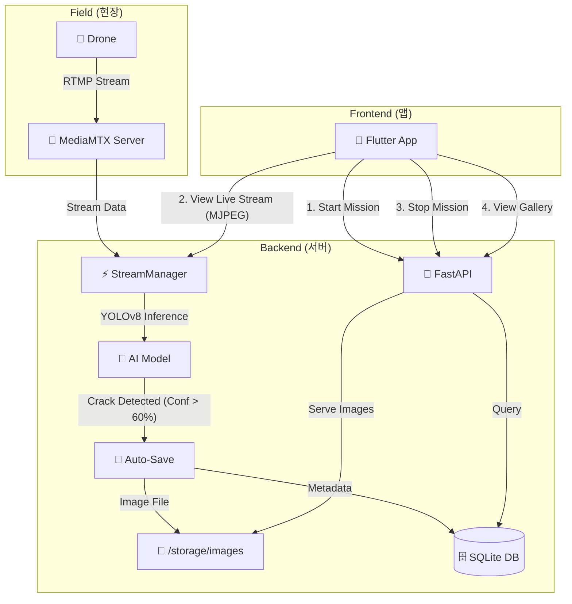
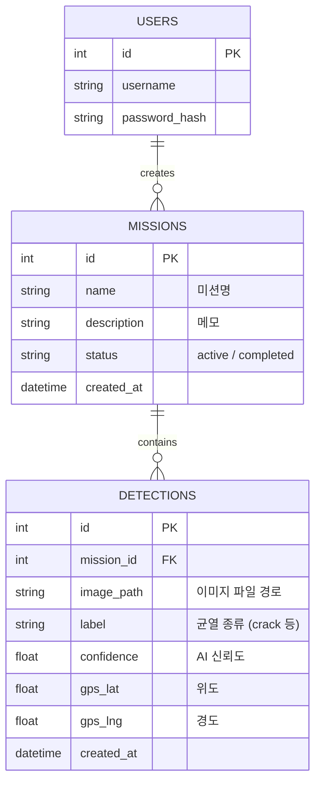
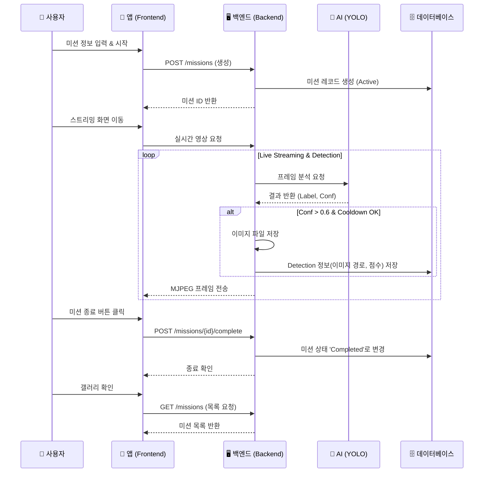

# 🚀 Wall-E 프로젝트 개발 리포트 (2026-02-11)

오늘 작업한 **실시간 스트리밍 및 AI 자동 감지 시스템**의 전체 구조와 흐름을 시각화했습니다.
이 문서는 팀 내 공유 및 기능 검토용으로 작성되었습니다.

## 1. 🏗️ 시스템 아키텍처 (System Architecture)

드론 영상을 실시간으로 분석하여 균열을 감지하고, 앱에서 이를 확인하는 전체 구조입니다.

---

## 2. ⚡ 주요 기능 명세 (Key Features)

### A. 👁️ AI 자동 감지 로직 (Auto-Detection)
사람의 개입 없이 AI가 스스로 균열을 판단하고 저장합니다.

| 조건 | 동작 | 설명 |
| :--- | :--- | :--- |
| **Confidence > 0.6** | ✅ **저장** | YOLO 모델의 확신이 60% 이상일 때만 기록 |
| **Mission Active** | ✅ **저장** | 미션이 진행 중일 때만 기록 (유휴 상태 제외) |
| **Cooldown** | ⏳ **대기** | 중복 저장을 막기 위해 2초 간격으로 제한 |

### B. 📸 갤러리 및 데이터 시각화
저장된 데이터를 앱에서 직관적으로 확인할 수 있습니다.

| 화면 | 기능 | 비고 |
| :--- | :--- | :--- |
| **Live Streaming** | 실시간 영상 송출 + 미션 제어 | MJPEG 스트리밍 (지연 최소화) |
| **Gallery** | 수행한 미션 목록 조회 | 날짜별, 미션별 정리 |
| **Mission Detail** | **감지된 균열 이미지 그리드 뷰** | 클릭 시 원본 이미지 확대 |

---

## 3. 💾 데이터베이스 스키마 (Database Schema)

효율적인 데이터 관리를 위해 정규화된 테이블 구조를 설계했습니다.

---

## 4. 🔄 미션 수행 프로세스 (Workflow)

사용자가 앱을 통해 미션을 수행하는 전체 과정입니다.

---

## 5. ✅ 금일 작업 완료 파일 (Created/Modified Files)

### Backend
- `backend/core/stream_manager.py`: 자동 감지 및 쿨다운 로직 구현
- `backend/api/missions.py`: 미션 제어 API
- `backend/db/models.py`: DB 스키마 정의
- `backend/main.py`: 정적 파일 서빙 설정
- `backend/scripts/merge_coco.py`: 학습 데이터 병합 스크립트

### Frontend
- `lib/services/api_service.dart`: API 연동 서비스
- `lib/screens/live_streaming_screen.dart`: 스트리밍 화면 & 종료 기능
- `lib/screens/gallery_screen.dart`: 미션 목록 UI
- `lib/screens/mission_detail_screen.dart`: 감지 결과 상세 보기 (신규)

---
**내일 예정 작업 (Next Steps)**
1. 🔗 팀원 데이터 취합 및 `merge_coco.py` 병합 실행 (오전)
2. 🏋️‍♂️ 병합된 데이터로 YOLOv11 모델 추가 학습 (오후)
3. 🗺️ 구글 지도 API 연동 (오후)
